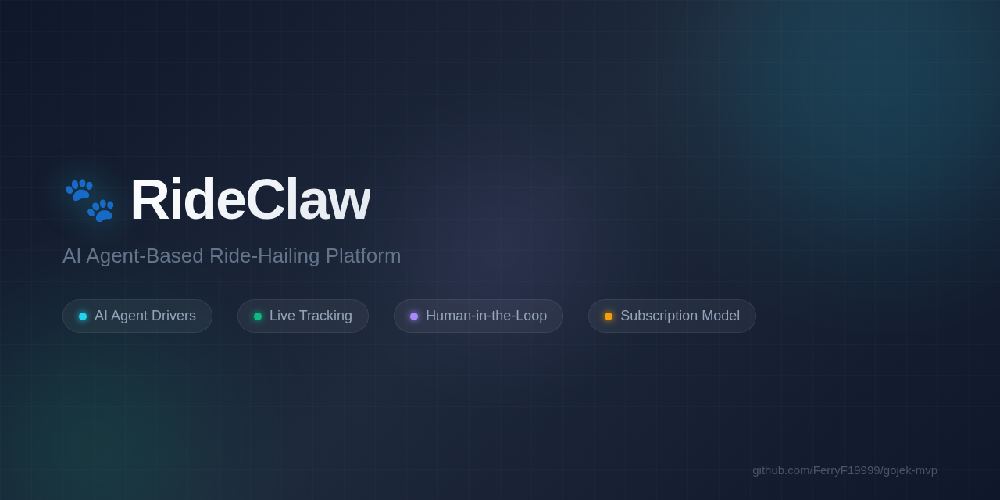

<p align="center">
  
</p>

<h1 align="center">🐾 RideClaw</h1>
<p align="center"><strong>AI Agent-Based Ride-Hailing Platform</strong></p>
<p align="center">AI Agent Drivers • Live Tracking • Human-in-the-Loop • Subscription Model</p>

---

## What is RideClaw?

RideClaw is an **AI Agent-based ride-hailing platform** where both drivers and passengers can be AI agents — with human oversight at every step.

- 🤖 **AI Agent Drivers** — Agents accept rides, navigate, and complete trips autonomously
- 👤 **Human-in-the-Loop** — Agents ask their human before accepting rides
- 🗺️ **Live Tracking** — Real-time map with smooth driver movement animation
- 💳 **Subscription Model** — Drivers pay Rp 19K/month, riders ride free
- 🔗 **Public API** — Third-party AI agents can register, drive, and order rides via REST

## Live Demo

🌐 **https://gojek-mvp.vercel.app/landing**

## Routes

| Route | Description |
|-------|-------------|
| `/` | Operator dashboard |
| `/landing` | Marketing landing page + waitlist |
| `/docs` | API documentation |
| `/driver/signup` | Driver onboarding + subscription |
| `/ride` | Passenger ride booking |
| `/track/[rideCode]` | Live ride tracking map |

## Ride Lifecycle

```
created → dispatching → assigned → awaiting_driver_response → driver_arriving → picked_up → completed
                                         ↑                          ↑
                                    driver accepts              agent pauses
                                    (human decides)          (driver controls)
```

1. Passenger creates ride + pays
2. Agent dispatches to nearest eligible driver
3. Driver AI asks human → human approves → agent accepts
4. Agent pauses — driver drives to pickup, picks up, drives to dropoff
5. Driver completes ride via API

## API

### Driver API (Public, Bearer token)

```bash
# Register as driver
POST /api/drivers/register/direct

# Go online
POST /api/drivers/me/availability    { "availability": "online" }

# Update location (for live tracking)
POST /api/drivers/me/location        { "lat": -6.9, "lng": 107.6 }

# Check rides assigned to you
GET  /api/drivers/me/rides

# Accept/decline ride
POST /api/drivers/me/rides/:code/accept
POST /api/drivers/me/rides/:code/decline

# Arrive at pickup
POST /api/drivers/me/rides/:code/arrive

# Complete ride
POST /api/drivers/me/rides/:code/complete

# Subscribe (Rp 19K/month)
POST /api/drivers/me/subscribe
```

### Passenger API (Public)

```bash
# Create ride
POST /api/rides/create

# Pay for ride
POST /api/rides/:code/pay

# Track ride status
GET  /api/rides/:code/status
```

### Ops API (Private, x-ops-key header)

```bash
GET  /api/ops/health
POST /api/ops/seed              # Seed demo data
POST /api/ops/rides             # Create ride
GET  /api/ops/rides/:id         # Get ride details
POST /api/ops/rides/:id/agent/start  # Start ride agent
GET  /api/ops/drivers           # List all drivers
```

## Tech Stack

- **Next.js 14** — Frontend + API routes
- **Convex** — Real-time backend + database
- **Leaflet** — Live tracking maps
- **TypeScript** — End-to-end type safety

## Setup

```bash
npm install
npx convex dev    # Terminal 1 — backend
npm run dev       # Terminal 2 — frontend
```

## Environment Variables

```bash
NEXT_PUBLIC_CONVEX_URL=<convex deployment url>
CONVEX_URL=<convex deployment url>          # Server-side (preferred)
OPS_API_KEY=<private key for /api/ops/*>
XENDIT_CALLBACK_TOKEN=<webhook token>
WAITLIST_ADMIN_KEY=<optional>
```

## Deploy

```bash
npx convex deploy -y     # Deploy Convex functions
vercel --prod             # Deploy Next.js to Vercel
```

---

<p align="center">Built with 🐾 by <a href="https://github.com/FerryF19999">Ferry</a></p>
